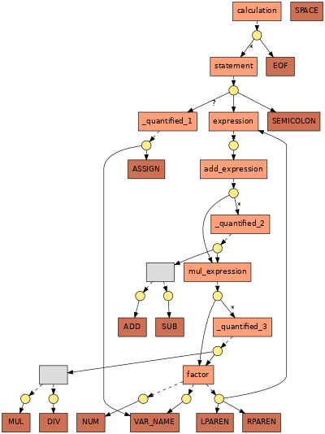

FuzzPEG: A Context-Free Random Program Generator
================================================

*FuzzPEG* is a random program generator. It takes as input a context-free grammar in EBNF and
efficiently generates syntactically valid programs for it. These programs can then be used to detect
bugs in compilers and other language processors.

To make *FuzzPEG* usable for practical purposes, it offers some advanced features:

- *FuzzPEG* not only tracks which parts of the input grammar have already been covered by previously
  generated programs, but can also guide the generation process towards uncovered parts of the
  grammar. This increases the diversity of the generated programs.
- To give the user more control over the size and shape of the generated programs, *FuzzPEG*
  supports probabilistic grammars. Such grammars include weights that determine the probability that
  certain alternatives are chosen.
- To avoid the construction of "infinitely" large programs in case of recursive grammars, *FuzzPEG*
  uses a height limit and only chooses alternatives that fit into this limit. *FuzzPEG*
  automatically chooses a height limit that allows to cover all parts of the input grammar (but the
  height limit can also be specified manually via a command line option).
- *FuzzPEG* ensures that the serialized programs are lexically valid (this is a necessary
  precondition for being syntactically valid):
  - When *FuzzPEG* generates a random token (e.g., an identifier), it makes sure that the randomly
    generated string does not collide with a different terminal (e.g., a keyword).
  - Simply concatenating two adjacent tokens may lead to an invalid result (e.g., if two adjacent
    identifiers `foo` and `bar` are concatenated, the resulting `foobar` no longer consists of two
    identifiers). Thus, *FuzzPEG* automatically determines if two adjacent tokens require a
    separator; by default, this separator consists of a single space (but the separator may also be
    specified via a command line option).

Although performance is not its top-most priority, *FuzzPEG* is reasonably efficient. On a standard
desktop computer and for a typical real-world grammar, *FuzzPEG* should be able to generate several
hundred KiB of syntactically valid output per second.

## Building FuzzPEG

*FuzzPEG* uses the [j-PEG](https://github.com/FAU-Inf2/j-PEG) library for parsing and analyzing the
input grammar, which is included as a Git submodule in `libs/j-PEG`. Use one of the following ways
to correctly set up this submodule:

- When cloning the *FuzzPEG* repository, add the command line option `--recurse-submodules`.
- If you already cloned the *FuzzPEG* repository without the aforementioned command line option,
  simply type `git submodule update --init` to set up the submodule.

When the submodule is correctly set up, simply type `./gradlew build` in the root directory of the
*FuzzPEG* repository to build the *FuzzPEG* framework. After a successful build, there should be a
file `build/libs/FuzzPEG.jar`. The instructions below assume that this file exists.

**Note**:

- You need a working JDK installation to build and run *FuzzPEG* (tested with OpenJDK 8 and 11).
- Building *FuzzPEG* requires an internet connection to resolve external dependencies.

## Input Grammars

*FuzzPEG* takes as input a context-free grammar that describes the lexical and syntactical rules
that the generated programs should conform to. The following is an example for such a grammar in the
notation of the [j-PEG](https://github.com/FAU-Inf2/j-PEG) library that *FuzzPEG* uses (to be more
precise, the grammars that *j-PEG* takes as input are so-called Parsing Expression Grammars (PEGs);
see [below](#a-note-on-grammar-classes) for a more detailed discussion):

    calculation: statement* EOF ;

    statement: ( VAR_NAME ASSIGN )? expression SEMICOLON ;

    expression: add_expression ;

    add_expression: mul_expression ( ( ADD | SUB ) mul_expression )* ;

    mul_expression: factor ( ( MUL | DIV ) factor )* ;

    factor
      : NUM
      | VAR_NAME
      | LPAREN expression RPAREN
      ;

    ASSIGN: ':=';
    SEMICOLON: ';';

    ADD: '+';
    SUB: '-';
    MUL: '*';
    DIV: '/';

    LPAREN: '(';
    RPAREN: ')';

    @skip
    SPACE: ( ' ' | '\n' | '\r' | '\t' )+ ;

    NUM: '0' | ( [1-9][0-9]* ) ;
    VAR_NAME: [a-zA-Z] [a-zA-Z0-9]* ;

This grammar matches programs of the following form:

    foo := (13 + 3) * 12;
    11 + foo;

### Terminal Rules

The names of terminal rules consist of upper case letters (e.g., `ASSIGN` or `SPACE`).

The right hand side of a terminal rule consists of a single regular expression (please refer to the
example above for the exact notation).

If a terminal rule is annotated with `@skip` (e.g., the `SPACE` rule from above), its matches are
discarded (i.e., its matches do not appear as tokens in the token stream).

The implicitly defined `EOF` rule matches the end of the input.

### Non-Terminal Rules

The names of non-terminal rules consist of lower case letters (e.g., `calculation` or `statement`).
The first non-terminal rule in the given grammar is the start rule with which the program
construction begins.

The right hand side of a non-terminal rule uses a notation similar to that of EBNF:

- `*` means zero or more repetitions
- `+` means one or more repetitions
- `?` means zero or one occurrences

Use the choice operator `|` to specify alternatives.

### Weighted Alternatives and Quantifiers

To be able to control the probability that *FuzzPEG* chooses certain alternatives during the program
construction, the alternatives can be annotated with a weight:

    foo
      : <13> ...
      |  <3> ...
      ;

In this example, the probability that *FuzzPEG* chooses the first alternative of `foo` is
(13 / (13 + 3)), while the probability that it chooses the second one is only (3 / (13 + 3)).

Similarly, it is possible to annotate quantifiers with a weight:

    bar
      : ( foo ) <3>+
      ;

During the program construction, *FuzzPEG* always ensures that the requirements induced by a
quantifier are met (in the example, *FuzzPEG* ensures that at least one `foo` is generated due to
the semantics of the `+` quantifier). However, if *FuzzPEG* can choose if it generates another
element or not, the probability that it generates another one is determined by the given weight (in
the example, another `foo` is generated with a probability of (3 / 4)).

Alternatives and quantifiers without explicit weight have an implicit weight of 1.

### A Note on Grammar Classes

*FuzzPEG* does not check (or care) which grammar class the input grammar belongs to (or if it is
ambiguous or not). In particular, although the [j-PEG](https://github.com/FAU-Inf2/j-PEG) library
that *FuzzPEG* uses treats the input grammar as a so-called *Parsing Expression Grammar* (PEG), it
is possible that the programs generated with *FuzzPEG* cannot be parsed successfully with a parser
for this PEG (but other parsing algorithms might be able to successfully parse them). This is due to
the fact that (in contrast to "traditional" context-free grammars in EBNF) the choice operator (`|`)
of PEGs is *ordered* (i.e., if the first alternative matches during parsing, the second one is
ignored). For example, consider the following PEG:

    foo: A | A B ;
    A: 'A' ;
    B: 'B' ;

Since *FuzzPEG* chooses alternatives randomly and "locally", *FuzzPEG* may generate the program
`AB`, which cannot be parsed according to this PEG: since the choice operator is ordered, the parser
strictly applies the first alternative of `foo` to match the `A` in `AB`, after which a single `B`
remains that cannot be parsed.

Whether this is a problem or not depends on your use case. If your goal is to generate programs that
can be parsed according to the given PEG, you have to rewrite the PEG such that it does not include
such cases. In the example, the following PEG can be used instead:

    foo: A B | A ;
    A: 'A' ;
    B: 'B' ;

If you are unsure whether a PEG contains such cases, you can use the `--testPEG` command line option
(see [below](#generating-random-programs-with-fuzzpeg)); if this option is set, *FuzzPEG* tries to
parse each randomly generated program according to the given PEG and prints an error message in case
of a failure.

## Grammar Graphs and Coverage

The input grammar induces a bi-partite graph, which we refer to as *grammar graph* and which is the
main data structure that *FuzzPEG* operates on (basically, *FuzzPEG* traverses this graph structure
during the program construction). Each node of such a grammar graph is either a `Choice` (this
includes all terminals and non-terminals of the grammar) or a `Sequence` (which, as the name
implies, represent sequences in the grammar). The edges from a `Choice` to a `Sequence` are called
`Alternative`s and the edges from a `Sequence` to a `Choice` are called `Element`s (such `Element`s
are annotated with the respective quantifier from the grammar, if any).

For the example grammar from above, the grammar graph looks as follows (rectangular nodes are
`Choice`s and circular nodes are `Sequence`s):

*FuzzPEG* can not only track which `Alternative`s (dashed arrows in the picture) have already been
chosen (covered), but can also guide the generation process towards uncovered `Alternative`s (see
below).

## Generating Random Programs With FuzzPEG

To just generate a single random program for a given grammar and to print it to stdout, simply call
the `run.sh` helper script and pass the path to the grammar file as argument:

    ./run.sh --grammar grammars/calculation.txt

In addition, *FuzzPEG* takes the following (optional) command line arguments:

- `--count <number>`: Specifies the number of programs that should be generated.
- `--seed <value>`: Specifies the initial random seed for the program generation.
- `--selection <selection strategy>`: Specifies the strategy that *FuzzPEG* should use to select
  alternatives and to determine the number of elements of quantified sub-rules. The following
  strategies are currently supported (the possible options are also described in
  `misc/selection.txt`):
  - `rand`: A weighted random selection based on the
    [weights](#weighted-alternatives-and-quantifiers) given in the input grammar.
  - `uniform`: A uniform random selection.
  - `small(<probability>, <base strategy>)` (where `<probability>` is a number between `0.0` and
    `1.0` and `<base strategy>` is another selection strategy): Chooses the alternative that leads
    to the smallest possible sub-tree with the specified `<probability>` (and uses the `<base
    strategy>` to select an alternative with a probability of `1-<probability>`). Thus, a larger
    `<probability>` generally leads to smaller programs.
  - `uncov(<strategy uncovered>, <strategy covered>)` (where `<strategy uncovered>` and `<strategy
    covered>` are other selection strategies): If there are uncovered alternatives, the `<strategy
    uncovered>` is used to select one of them; otherwise, the `<strategy covered>` is used to select
    one of the (already covered) alternatives.
  - `reachesUncov(<strategy uncovered>, <strategy covered>, <strict quantifiers>)` (where `<strategy
    uncovered>` and `<strategy covered>` are other selection strategies and `<strict quantifiers>`
    is either `true` or `false`): If there are alternatives that are still uncovered or that may
    lead to uncovered alternatives further down in the tree, the `<strategy uncovered>` is used to
    select one of them; otherwise, the `<strategy covered>` is used to select one of the
    alternatives. If `<strict quantifiers>` is set to `true`, another element of a quantified
    sub-rule is generated if (and only if) this may lead to still uncovered alternatives.

## License

*FuzzPEG* is licensed under the terms of the MIT license (see [LICENSE.mit](LICENSE.mit)).

*FuzzPEG* makes use of the following open-source projects:

- Gradle (licensed under the terms of Apache License 2.0)
